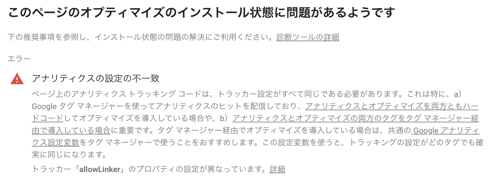
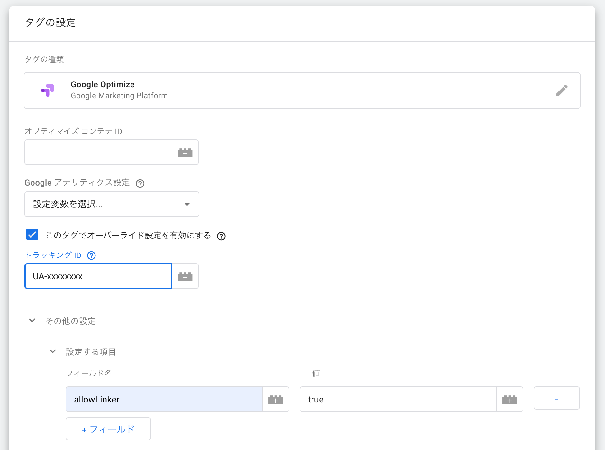
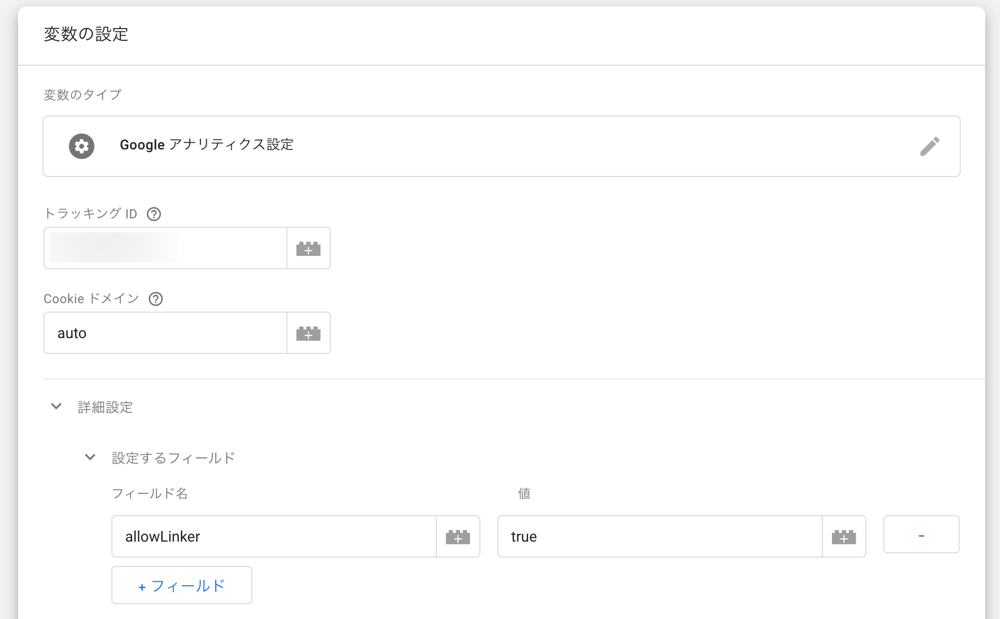
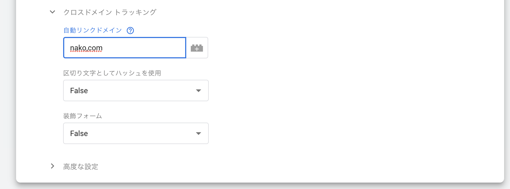
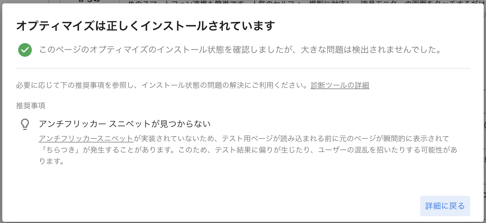

# クロスドメイントラッキングを導入したらoptimizeが動かなくなった

**目次**

[[toc]]

## はじめに

google optimizeをご存知でしょうか？
簡単にA/Bテストやリダイレクトテストが導入できるサービスです。

[公式サイト](https://marketingplatform.google.com/intl/ja/about/optimize/)

今回は以下のサービスを連携しさらにクロスドメイントラッキングの設定した際のハマったので備忘録的にメモしておきたいと思います。

* google optimize：Webサイトテストツール
* google analytics：テスト結果を送信して、表示
* google tagmanager：上記タグの配信

### 前提

* google analytics導入済
* google tagmanager導入済

## optimizeの導入

まずはgoogle optimizeのユーザー登録をしましょう。
ここでは登録からテストの作成までは割愛させていただきます。
以下のblogが非常に参考になったので掲載させていただきます。

[Google Optimizeを使ってサイト改善を手軽にはじめよう](https://ferret-plus.com/curriculums/10561)


## テストについて

今回はある特定のURLにおいてのA/Bテストを想定します。

以下を前提とします。

* ECサイトと決済サイトは別ドメインでの運用です
* ECサイトのドメインを「inu.com」決済サービスを「neko.com」とします
* 2つのページでそれぞれ別のA/Bテストを実施します
* 2つのページをそれぞれ「丁」と「半」とします
* tagmanager【A】/【B】からそれぞれanlyticsとoptimizeを配信しています
* 「丁」のページだけ異なるanalyticsの配信がされています
  * こちらのanalyticsはtagmanager【A】から配信されています
* optimizeはtagmanager【B】から配信されています
* tagmanager経由以外にapplicationに埋め込まれているanalyticsもあります

## クロスドメイントラッキングの導入

今回あるサイトにクロスドメイントラッキングを導入した際にoptimizeが動かなくなりました。

クロスドメイントラッキングの公式の説明は以下になります。
[クロスドメイントラッキングとは](https://support.google.com/analytics/answer/1034342?hl=ja)

公式の説明を引用します。

> 2つの関連サイト（eコマースサイトと、別のショッピングカートサイトなど）でのセッションが 1 回のセッションとしてアナリティクス レポートに記録されます。これは「サイト間のリンク」とも呼ばれます。

「eコマースサイトと、別のショッピングカートサイト」とありますが、想定されそうなものとして決済部分だけ別サービスに任せているECサイトなどでしょうか。
そのような場合何も設定しなければ、決済ようのサイトに移動した瞬間、その後戻ってくるとしてもセッション自体は切れてしまいます。

それらの間を補完し一つのセッションとしてつなぐ役割がクロスドメイントラッキングになります。

### コードの変更

公式サイトから引用しますが、以下のようなgaをアプリケーション(inu.com)の中に記載していました。

```js
ga('create', 'UA-XXXXXXX-Y', 'inu.com');
```

それを今回設定のために以下のように変更しました。

```js
ga('create', 'UA-XXXXXXX-Y', 'auto', {'allowLinker': true});
ga('require', 'linker');
ga('linker:autoLink', ['neko.com'] );
```

また行った先の決済サービスは以下のように変更します。

```js
ga('create', 'UA-XXXXXXX-Y', 'auto', {'allowLinker': true});
ga('require', 'linker');
ga('linker:autoLink', ['inu.com'] );
```

これらの設定後に、レポートにドメインを表示する設定や、参照元除外リストへのドメインの登録などを行います。

[※参考※クロスドメイン トラッキングを設定する（analytics.js）](https://support.google.com/analytics/answer/1034342?hl=ja)

これで二つのドメインをまたいでも同じセッションとして計測ができるようになりました。

## optimizeが動かなくなった

めでたしめでたしと思いきや、上記を設定した後optimizeが動作しなくなりました。  
診断を行うと下記のような表記が出てエラーで止まってしまいます。



最終行に以下の文言の記載があり、詳細へのリンクがあるので、そこをクリックしてみます。

> トラッカー「allowLinker」のプロパティの設定が異なっています。

[アナリティクス設定の不一致](https://support.google.com/optimize/answer/7577190#analytics-configuration-mismatch)

## アナリティクス設定の不一致

リンク先を見ると以下のようなことが記載されています。

> ページ上のすべてのアナリティクス トラッキング コードでは、同じトラッカー設定を使用する必要があります。

よくよく読んで見ると今回設定したallowLinkerの設定をはじめ、analyticsとタグマネ経由のanalyticsで一致していないとエラーになる設定があるようです。  
今回optimizeをタグマネージャー経由で配信していたので、allowLinkerの設定をそちらに設定します。

### tagmangerB経由のgoogle optimizeタグへの設定

tagmangerで配信しているタグにallowLinkerを設定する方法はいくつかあるようです。

1. タグのオーバーライド設定で反映
google tagmanagerを配信している該当のタグの設定画面内に
「このタグでオーバーライド設定を有効にする」
という項目があるのでそれにチェックを入れます。

そしてトラッキングIDに該当のgoogle analyticsのトラッキングIDを入れて
「その他の設定」→「設定する項目」→「+フィールドクリック」→フィールド名とvalueを追加
します。



2. 変数そのものを設定
tagmanagerの中でも複数のタグに同じアナリティクス設定を行なっている場合もあるかと思います。
その場合任意で設定する変数にあらかじめ設定してしまうこともできるようです。

今回はこちらの方法を選択し、以下を設定しました。

* 変数の設定で「設定するフィールド」→「+フィールドクリック」→フィールド名とvalueを追加
* クロスドメイントラッキングの項目を設定




## やはり片方だけ動かない

上記設定を行い、「半」のページでoptimizeを診断してみたら無事動作しました。

さてこれで一安心と思いきや、「丁」のページだけ診断でエラーが出てしまいます。
ここで前提の中の以下の条件を思い出します。

```md
* tagmanager【A】/【B】からそれぞれanlyticsとoptimizeを配信しています
* 「丁」のページだけ異なるanalyticsの配信がされています
  * こちらのanalyticsはtagmanager【A】から配信されています
* optimizeはtagmanager【B】から配信されています
```

この「こちらのanalyticsはtagmanager【A】から配信されています」という条件がネックになっていました。

結論から行ってしまうと、optimizeを配信していた側のtagmanager【B】の設定だけではなく、
analyticsを配信していたtagmanager【A】の設定も変更する必要がありました。

## デバッグ方法

ここから原因を特定するために調査に入りました。

### google tag assistants

まずはgoogle tag assistantsで動作を確認します。  
google tag assistantsはgoogleが公式に配布しているchrome拡張です。  
埋め込まれているタグの内容や種類であったり、状態を簡単に調べることができます。

[Tag Assistant (by Google)](https://chrome.google.com/webstore/detail/tag-assistant-by-google/kejbdjndbnbjgmefkgdddjlbokphdefk?hl=ja)

これで確認してみるとoptimizeでの診断通り「半」のページではエラーがなく「丁」のページではエラーになります。
ただこちらではanalytics mismatchと出るだけで詳細はわかりません。

### tagmanagerでプレビュー

この時点では原因がほかのanalyticsによるものだと判明していなかったので、
optimizeを配信している方のtagmanager【B】の設定を変更することで事態が改善しないか試しています。

tagmanager【B】で配信しているoptimizeの内容を変更して確認します。
フィールド設定されている箇所の内容を変更するなどしましたが、全く同じanalyticsが記載されているはずの2つのページで差が出ている状態なので、
当然ながらこれを変更したところで変化はありません。

### Google Analytics Debugger
次に配信されているanalyticsの設定が2つのページで異なる可能性を考えて、
Google Analytics Debuggerを使用して配信されているanalyticsの中身を確認しました。
Google Analytics Debuggerもgoogle公式のchrome拡張です。

[Google Analytics Debugger](https://chrome.google.com/webstore/detail/google-analytics-debugger/jnkmfdileelhofjcijamephohjechhna?hl=ja)

ここで「丁」のページだけallowLinkerが設定されていないanalyticsを発見しました。

## tagmanager【A】経由のanalyticsにallowLinker追加
配信元のtagmanagerのIDを追っていくと直接アプリケーションに入れたものではなくて、別のtagmanagerから入れられたものだとわかりました。
ですので、そちらのアナリティクスの設定にも`allowLinker:true`を設定します。

ここでの追加方法は割愛しますが、基本的にはoptimize配信をしているtagmanagerと設定方法はほぼ同じです。

### optimizeで診断
上記を対応したのちに診断を実行したところ無事診断に合格しました。



## 最後に
最後まで読んでくださってありがとうございました。
今回の一番の問題は「2重管理になっている状態」の一言に尽きるかと思います。

* アプリケーションに埋め込まれたanalytics
* tagmanager経由のoptimize配信
* tagmanager経由のanalytics配信(アプリケーション埋め込みと同一のトラッキングID)
* optimizeとanalyticsを配信しているtagmanagerは別

上記のような条件の場合はそもそも少ないとは思いますが、
今後万が一似たような状況になった場合にどのようにデバッグをするべきかの知見はある程度得たと思います。


